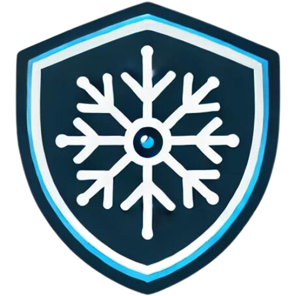

#  [Skiguard](https://scalecraft.dev/skiguard)

This repo contains an example of how to use the Skiguard application. It also contains an example Kustomize base to deploy the application to a Kubernetes cluster.

[](https://www.youtube.com/watch?v=MxtE8h8xetQ)

## Quick Start

1. Sign up for a [Skiguard trial account](https://buy.stripe.com/00g6s58je5Xn6T6cMM). You will receive an email with your license key. No payment required for trial.
2. Create a Snowflake user for Skiguard. [Example](./docs/skiguard-account-setup.sql) script.
3. Configure your environment variables. You can use the [.env.example file](./docs/.env.example) as a template.
4. Create a Slackbot and get the token and channel ID. [Slack API](https://api.slack.com/apps). [App manifest example](./docs/slackbot-manifest.json). (Optional)
5. Run the Skiguard application.

    ```bash
    docker run -it --rm \
    -e SNOWFLAKE_ACCOUNT=${SNOWFLAKE_ACCOUNT} \
    -e SNOWFLAKE_USER=${SNOWFLAKE_USER} \
    -e SNOWFLAKE_PASSWORD=${SNOWFLAKE_PASSWORD} \
    -e SNOWFLAKE_WAREHOUSE=${SNOWFLAKE_WAREHOUSE} \
    -e SNOWFLAKE_ROLE=${SNOWFLAKE_ROLE} \
    -e SLACK_TOKEN=${SLACK_TOKEN} \
    -e SLACK_CHANNEL_ID=${SLACK_CHANNEL_ID} \
    -e SKIGUARD_LICENSE_KEY=${SKIGUARD_LICENSE_KEY} \
    -p 8088:8088 \
    scalecraft/skiguard:latest
    ```

6. Access the Skiguard account health dashboard at [http://localhost:8088](http://localhost:8088). The default username is `admin` and the default password is `admin`.

## Snowflake Configuration

You will need to create a Snowflake user for Skiguard. The user will need the following permissions on the `SNOWFLAKE` database. You can read more about database roles in the [Snowflake documentation](https://docs.snowflake.com/en/sql-reference/account-usage#account-usage-views-by-database-role). It is also recommended to use a network policy to restrict access to the server where Skiguard is running.
  
```sql
create user skiguard;
alter user skiguard set password = '<password_here>';
create role skiguard;

grant role skiguard to user skiguard;
grant usage on warehouse compute_wh to role skiguard;

use snowflake;

grant database role usage_viewer to role skiguard;
grant database role security_viewer to role skiguard;

-- All password accounts should use a network policy to restrict access.
create network rule skiguard_ingress
  mode = INGRESS
  type = IPV4
  value_list = ('<skiguard server IP>');

create network policy skiguard
  allowed_network_rule_list = ('skiguard_ingress');

alter user skiguard set network_policy = skiguard;
```

## Slackbot Configuration

You can optionally create a Slackbot to receive notifications from Skiguard. The app manifest below will create a bot with the name `Skiguard`. You can use the [Skiguard logo](./docs/skiguard-logo.png) as the bot avatar.

```json
{
    "display_information": {
        "name": "Skiguard",
        "description": "Snowflake security monitoring app",
        "background_color": "#0f0f0f",
        "long_description": "Skiguard monitors Snowflake for abnormal activity and posts alerts to slack for awareness. The following Snowflake activity is monitored.\r\n\r\n* User Deletion\r\n* User Creation\r\n* Number of rows copied out of Snowflake\r\n* Number of copy actions out of Snowflake\r\n* Failed Logins\r\n* Total Logins"
    },
    "features": {
        "bot_user": {
            "display_name": "Skiguard",
            "always_online": true
        }
    },
    "oauth_config": {
        "redirect_urls": [
            "https://slack.com/oauth/v2/authorize?scope=channels:join,chat:write"
        ],
        "scopes": {
            "bot": [
                "channels:join",
                "chat:write"
            ]
        }
    },
    "settings": {
        "org_deploy_enabled": false,
        "socket_mode_enabled": false,
        "token_rotation_enabled": false
    }
}
```

## Kubernetes Deployment

You can deploy the Skiguard application to a Kubernetes cluster using the Kustomize base in the [k8s directory](./k8s). You will need to create a secret with the environment variables for the Skiguard application. An example secret is provided in the [k8s directory](./k8s/secrets.sh).

## Docker Compose

You can also run the Skiguard application using Docker Compose. An example `docker-compose.yaml` file is provided [here](./docs/docker-compose.yaml).
